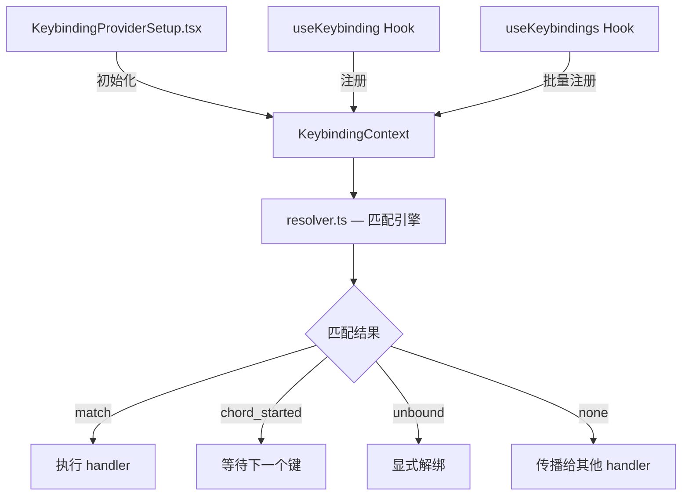

# `keybindings/` — 键绑定系统

## 模块概述

可配置的快捷键系统，支持用户自定义按键映射、多上下文优先级、**和弦序列**（如 `ctrl+k ctrl+s`）。

## 架构



## 快捷键分类

| 上下文 | 示例快捷键 | 说明 |
|--------|-----------|------|
| Chat | `Escape`/`Ctrl+C` | 取消当前操作 |
| Chat | `Ctrl+O` | 打开转录 |
| Transcript | `j/k` | Vim 风格上下导航 |
| Transcript | `/` | 搜索 |
| Confirmation | `Escape`/`n` | 取消确认 |
| Confirmation | `Enter` | 确认 |
| Help | `Escape` | 关闭帮助 |
| Global | 自定义 | 用户配置的全局快捷键 |

## 核心：`resolver.ts` — 匹配引擎

### 单键匹配

```typescript
type ResolveResult =
  | { type: 'match'; action: string }   // 匹配到动作
  | { type: 'none' }                     // 无匹配
  | { type: 'unbound' }                  // 显式解绑

function resolveKey(input, key, activeContexts, bindings): ResolveResult {
  const ctxSet = new Set(activeContexts)
  let match: ParsedBinding | undefined
  for (const binding of bindings) {
    if (binding.chord.length !== 1) continue  // 跳过和弦
    if (!ctxSet.has(binding.context)) continue // 上下文过滤
    if (matchesBinding(input, key, binding)) {
      match = binding  // 后者优先 → 用户覆盖默认
    }
  }
  // ...
}
```

!!! note "后者优先规则"
    用户自定义绑定排在数组末尾，自然覆盖默认绑定——无需额外优先级字段。

### 和弦（Chord）匹配

```typescript
type ChordResolveResult =
  | { type: 'match'; action: string }
  | { type: 'none' }
  | { type: 'unbound' }
  | { type: 'chord_started'; pending: ParsedKeystroke[] }  // 等待更多键
  | { type: 'chord_cancelled' }                            // 和弦取消
```

**状态机流程**：

```
无 pending → 按键
  ├─ 完全匹配 → 执行动作
  ├─ 有更长前缀 → chord_started（进入等待）
  └─ 无匹配 → none

有 pending → 按键
  ├─ Escape → chord_cancelled
  ├─ 完全匹配 → 执行动作
  └─ 无匹配 → chord_cancelled
```

!!! tip "智能遮蔽"
    null-override 后的和弦被遮蔽——解绑 `ctrl+x ctrl+k` 后，`ctrl+x` 的单键绑定正常工作。

### 修饰键处理

```typescript
// Alt 和 Meta 合并为一个逻辑修饰符
// 传统终端无法区分它们
(a.alt || a.meta) === (b.alt || b.meta)

// Super（Cmd/Win）是独立的
// 仅通过 Kitty 键盘协议传入
a.super === b.super
```

## Hook API：`useKeybinding.ts`

### `useKeybinding` — 单一绑定

```tsx
useKeybinding('app:toggleTodos', () => {
  setShowTodos(prev => !prev)
}, { context: 'Global' })
```

- handler 返回 `false` 表示"未消费"，事件继续传播
- 自动调用 `event.stopImmediatePropagation()` 防止其他 handler 触发
- 注册到 `KeybindingContext` 供 `ChordInterceptor` 调用

### `useKeybindings` — 批量绑定

```tsx
useKeybindings({
  'chat:submit': () => handleSubmit(),
  'chat:cancel': () => handleCancel(),
}, { context: 'Chat' })
```

减少 `useInput` 调用数量，提升性能。

## 上下文优先级

```
registeredActive > component context > Global
```

通过 `Set` 去重保持顺序，确保更具体的上下文优先匹配。

## 核心组件

| 文件 | 说明 |
|------|------|
| `KeybindingContext.ts` | React Context 提供快捷键解析器 |
| `KeybindingProviderSetup.tsx` | 初始化 + 加载用户自定义配置 |
| `resolver.ts` | 匹配逻辑（单键 + 和弦 + 修饰键） |
| `useKeybinding.ts` | Hook：注册快捷键处理器 |
| `shortcutFormat.ts` | 格式化显示（`⌘C`、`Ctrl+C`） |
| `types.ts` | `ParsedKeystroke`（key + ctrl/shift/alt/meta/super） |
| `parser.ts` | 解析字符串 `"ctrl+shift+t"` → `ParsedKeystroke` |
| `match.ts` | 底层按键匹配 + 修饰键比较 |

## 总结

`keybindings/` 实现了一个完整的可配置快捷键系统，支持单键绑定、和弦序列、多上下文优先级和用户自定义覆盖。通过 `useKeybinding` / `useKeybindings` Hook 提供声明式 API，让组件轻松注册快捷键处理器。
