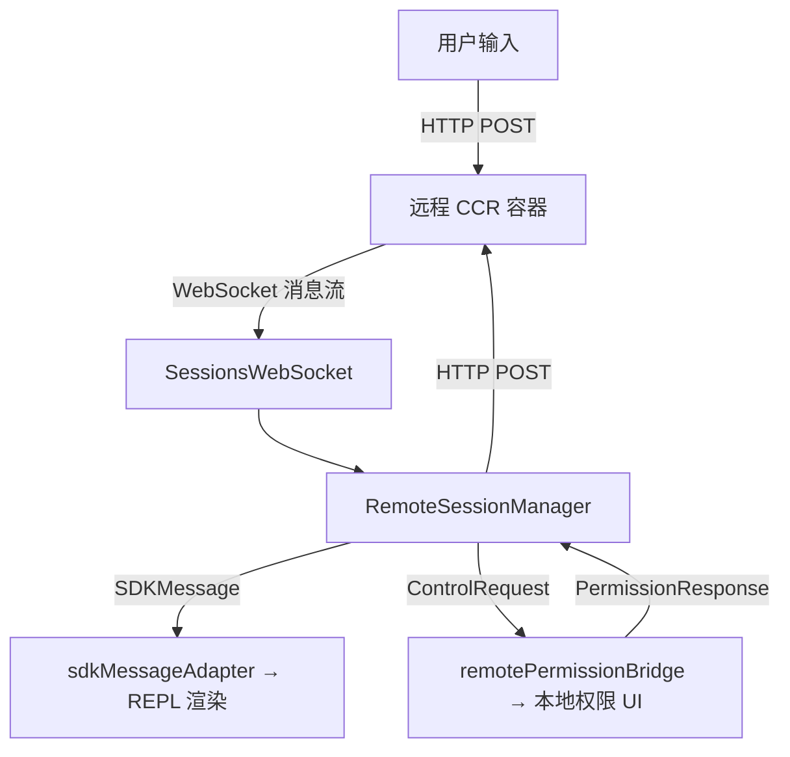

# `remote/` — 远程会话管理

## 模块概述

`remote/` 模块处理 Claude Code 与**远程 CCR（Claude Code Remote）容器**之间的通信。当用户使用 `--remote` 模式时，AI 在远程容器中运行，本地 CLI 作为"瘦客户端"显示结果和处理权限请求。

## 文件清单

| 文件 | 说明 |
|------|------|
| `RemoteSessionManager.ts` | 远程会话管理器（WebSocket + HTTP） |
| `SessionsWebSocket.ts` | WebSocket 客户端（自动重连、ping keepalive） |
| `remotePermissionBridge.ts` | 远程权限请求的消息桥接 |
| `sdkMessageAdapter.ts` | SDK 消息格式 → REPL 内部格式转换 |

## 核心架构



## `RemoteSessionManager` — 会话协调器

协调 WebSocket 订阅 + HTTP POST 发送 + 权限请求/响应流：

```typescript
type RemoteSessionConfig = {
  sessionId: string
  getAccessToken: () => string
  orgUuid: string
  hasInitialPrompt?: boolean
  viewerOnly?: boolean   // 纯观察者模式
}
```

### 消息路由

| 消息类型 | 处理方式 |
|----------|---------|
| `control_request` | → `handleControlRequest()` → 弹出本地权限提示 |
| `control_cancel_request` | → 清除 pending 权限请求 |
| `control_response` | → 日志记录（确认） |
| 其他 `SDKMessage` | → 转发给 `onMessage` 回调 → REPL 渲染 |

!!! note "viewerOnly 模式"
    纯观察者模式下：不发送中断、禁用 60s 重连超时、不更新会话标题。用于 `claude assistant` 命令。

## `SessionsWebSocket` — WebSocket 重连引擎

### 连接协议

```
1. 连接 wss://api.anthropic.com/v1/sessions/ws/{sessionId}/subscribe
2. 发送认证消息: { type: 'auth', credential: { type: 'oauth', token: '...' } }
3. 接收 SDKMessage 流
```

### 重连策略

| 参数 | 值 | 说明 |
|------|-----|------|
| `RECONNECT_DELAY_MS` | 2000 | 重连间隔 |
| `MAX_RECONNECT_ATTEMPTS` | 5 | 最大重连次数 |
| `PING_INTERVAL_MS` | 30000 | 保活心跳 |
| `MAX_SESSION_NOT_FOUND_RETRIES` | 3 | 4001 错误有限重试 |

### 关闭码处理

```typescript
// 永久关闭 → 立即停止重连
PERMANENT_CLOSE_CODES = new Set([4003])  // unauthorized

// 瞬态关闭 → 有限重试
4001 (session not found) → 最多重试 3 次
// 用于 compaction 期间的临时不可用
```

### 双运行时支持

```typescript
if (typeof Bun !== 'undefined') {
  // Bun: 原生 WebSocket，headers 直接传入
  new globalThis.WebSocket(url, { headers, proxy, tls })
} else {
  // Node.js: 使用 ws 库
  const { WebSocket } = await import('ws')
}
```

**状态机**：`connecting → connected → closed`

## 关键设计

- **双通道通信**：WebSocket 接收消息流，HTTP POST 发送用户输入
- **权限桥接**：远程工具调用需要本地用户确认权限
- **自动重连**：2s 间隔 + 最多 5 次 + 4001 有限重试
- **Bun/Node 双运行时**：根据环境选择不同的 WebSocket 实现
- **viewerOnly**：纯观察模式，不干扰远程执行

## 总结

`remote/` 模块让 Claude Code 变成"瘦客户端"——AI 在云端 CCR 容器执行，本地只负责显示和权限管理。核心是 `SessionsWebSocket` 的自动重连引擎和 `RemoteSessionManager` 的消息路由与权限桥接。
