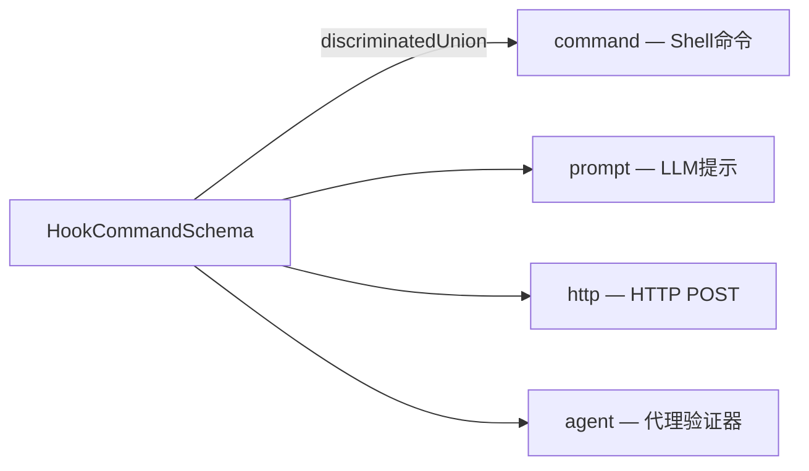

# `schemas/` — Zod 校验 Schema

## 模块概述

集中管理所有 Zod 校验 Schema，为 API 响应、配置文件、消息格式等提供运行时类型验证。

!!! info "模块特点"
    `schemas/` 目录目前只有 **1 个文件** `hooks.ts`（7.7KB），但它是整个 Hook 系统的类型基石，从 `settings/types.ts` 中提取出来以打破循环依赖。

## Hook Schema 详解

### 4 种 Hook 类型



| Hook 类型 | Schema | 用途 | 特有字段 |
|-----------|--------|------|---------|
| `command` | `BashCommandHookSchema` | 执行 Shell 命令 | `shell`, `async`, `asyncRewake`, `command` |
| `prompt` | `PromptHookSchema` | LLM 提示评估 | `prompt`(`$ARGUMENTS` 占位符), `model` |
| `http` | `HttpHookSchema` | HTTP POST 请求 | `url`, `headers`(支持环境变量插值), `allowedEnvVars` |
| `agent` | `AgentHookSchema` | 代理验证器 | `prompt`, `model`(默认 Haiku) |

### 共享字段

所有 Hook 类型都支持这些字段：

```typescript
{
  if?: string        // 权限规则语法过滤，如 "Bash(git *)"
  timeout?: number   // 超时秒数
  statusMessage?: string  // Spinner 显示消息
  once?: boolean     // 是否只执行一次
}
```

### Schema 组合层次

```typescript
// 1. 单个 Hook 命令（4 选 1）
HookCommandSchema = z.discriminatedUnion('type', [
  BashCommandHookSchema, PromptHookSchema,
  AgentHookSchema, HttpHookSchema,
])

// 2. 匹配器（事件匹配 + Hook 列表）
HookMatcherSchema = z.object({
  matcher?: string,           // 如 "Write" 匹配工具名
  hooks: HookCommand[],       // 匹配时执行的 Hook 列表
})

// 3. 顶层配置（事件名 → 匹配器数组）
HooksSchema = z.partialRecord(
  z.enum(HOOK_EVENTS),        // 所有生命周期事件
  z.array(HookMatcherSchema())
)
```

### HTTP Hook 安全机制

```typescript
// Headers 支持环境变量插值
headers: { "Authorization": "Bearer $MY_TOKEN" }
// 但必须显式声明允许的变量名
allowedEnvVars: ["MY_TOKEN"]
// 未列出的 $VAR 引用解析为空字符串
```

## 设计原则

- **Zod v4**：使用 `zod/v4` 最新版本
- **懒加载**：`lazySchema(() => z.enum(...))` 延迟构建，避免循环依赖
- **打破循环导入**：从 `settings/types.ts` 提取到独立文件，让 `settings/types.ts` 和 `plugins/schemas.ts` 都可以安全导入
- **渐进验证**：解析失败时记录日志但不阻断，返回 `undefined`

## 导出类型

```typescript
export type HookCommand     // 4 种 Hook 类型的联合
export type BashCommandHook // command 类型
export type PromptHook      // prompt 类型
export type AgentHook       // agent 类型
export type HttpHook        // http 类型
export type HookMatcher     // 匹配器
export type HooksSettings   // 完整配置
```

## 总结

`schemas/hooks.ts` 是 Hook 系统的 Zod 校验基石，定义了 4 种 Hook 类型（Shell/LLM/HTTP/Agent）的完整 Schema 层次。通过 `discriminatedUnion` 实现类型安全的 Hook 配置，通过 `lazySchema` 打破模块间的循环依赖。
