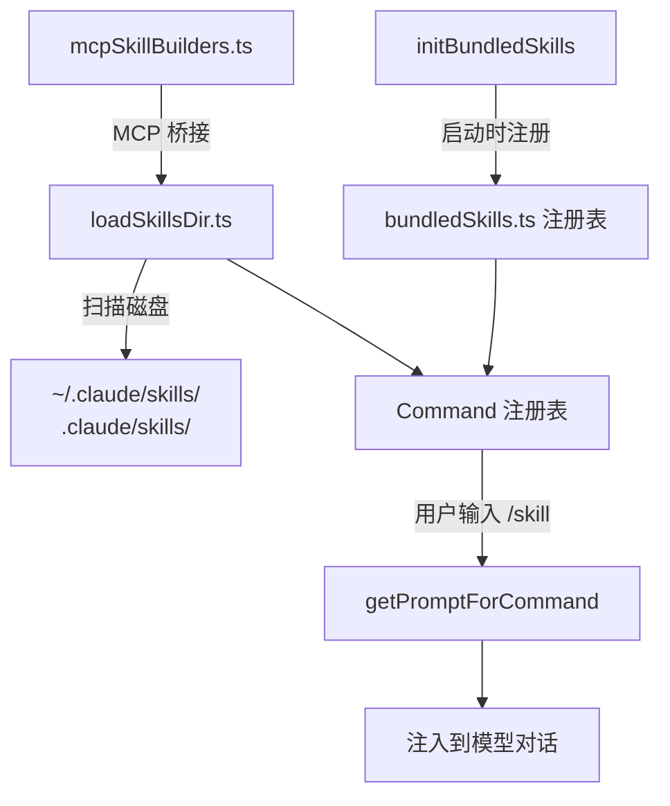

# `skills/` — Skills 技能系统

## 模块概述

`skills/` 是 Claude Code 的**可扩展技能系统**——类似插件但更轻量。技能通过 Markdown frontmatter 定义，注入到模型对话中作为 prompt，让 AI 获得特定领域的能力。

**20 个文件** | 核心注册表 + 文件加载器 + **17 个内置技能**

## 架构总览



## 核心文件

### 1. `bundledSkills.ts` — 技能注册表核心

定义 `BundledSkillDefinition` 类型并管理技能的注册与提取：

```typescript
type BundledSkillDefinition = {
  name: string
  description: string
  aliases?: string[]
  whenToUse?: string            // 模型自动调用判断
  allowedTools?: string[]       // 允许使用的工具白名单
  model?: string                // 指定模型
  disableModelInvocation?: boolean
  userInvocable?: boolean       // 是否用户可直接调用
  hooks?: HooksSettings         // 生命周期钩子
  context?: 'inline' | 'fork'  // 执行上下文
  files?: Record<string, string> // 附加参考文件
  getPromptForCommand: (args, ctx) => Promise<ContentBlockParam[]>
}
```

!!! note "安全文件提取"
    当技能包含 `files` 字段时，使用 `O_NOFOLLOW | O_EXCL` 和 `0o600` 权限写入，防止符号链接攻击和路径遍历。

### 2. `bundled/index.ts` — 内置技能初始化

`initBundledSkills()` 在启动时注册所有内置技能：

| 注册方式 | 技能 | 数量 |
|----------|------|------|
| **无条件注册** | config, keybindings, verify, debug, loremIpsum, skillify, remember, simplify, batch, stuck | **10** |
| **Feature Flag** | dream(`KAIROS`), hunter(`REVIEW_ARTIFACT`), loop(`AGENT_TRIGGERS`), scheduleRemoteAgents, claudeApi, runSkillGenerator | **6** |
| **运行时条件** | claudeInChrome（需 `shouldAutoEnableClaudeInChrome()`） | **1** |

!!! tip "懒加载策略"
    Feature Flag 技能使用 `require()` 延迟加载，避免将代码打入主 bundle。

### 3. `loadSkillsDir.ts` — 文件系统技能加载器

从磁盘扫描用户自定义技能（**1,087 行，33KB**，模块内最大文件）：

```typescript
type LoadedFrom = 'commands_DEPRECATED' | 'skills' | 'plugin'
                | 'managed' | 'bundled' | 'mcp'
```

**技能发现流程**：

1. 扫描 `~/.claude/skills/`、`.claude/skills/`、policy 目录
2. 解析 `.md` 文件的 YAML frontmatter（支持 16+ 个字段）
3. 通过 `realpath` 去重（解析符号链接，避免重复加载）
4. 注册到全局 `Command` 注册表

**支持的 frontmatter 字段**：

| 字段 | 说明 |
|------|------|
| `description` | 技能描述 |
| `allowed-tools` | 工具白名单 |
| `when_to_use` | 自动调用条件 |
| `model` | 指定模型（`inherit` 表示继承） |
| `hooks` | 生命周期钩子配置 |
| `context` | `fork` = 独立上下文 |
| `agent` | 关联的 Agent 定义 |
| `effort` | 计算资源级别 |
| `paths` | 路径过滤（gitignore 语法） |
| `shell` | Shell 类型 |

### 4. `mcpSkillBuilders.ts` — 打破循环依赖

Write-once 注册表模式，解决 `client.ts → mcpSkills.ts → loadSkillsDir.ts → … → client.ts` 的循环导入：

```typescript
let builders: MCPSkillBuilders | null = null

export function registerMCPSkillBuilders(b: MCPSkillBuilders): void {
  builders = b  // 写一次，之后只读
}
```

## 内置技能一览

| 技能 | 用途 | 特点 |
|------|------|------|
| `/config` | 更新配置 | 最大技能文件（17KB） |
| `/keybindings` | 快捷键管理 | 10KB |
| `/debug` | 调试当前会话 | 读取 debug log 末尾 20 行 |
| `/remember` | 记忆管理 | 审查和整理 auto-memory |
| `/verify` | 验证代码变更 | 带参考文件提取 |
| `/skillify` | 创建新技能 | 技能创建向导（9KB） |
| `/batch` | 批处理任务 | 7KB |
| `/stuck` | 卡住时求助 | 诊断和建议 |
| `/simplify` | 简化代码 | |
| `/loremIpsum` | 生成占位文本 | |

## 技能执行流程

```
用户输入 /skillname args
  → 查找 Command 注册表（bundled + 文件系统 + MCP）
  → command.getPromptForCommand(args, context)
  → 返回 ContentBlockParam[]（text 块）
  → 注入到模型对话作为 prompt
  → 模型可使用 allowedTools 指定的工具
```

## 总结

`skills/` 实现了一个**三来源技能系统**：内置（bundled）、文件系统（`.claude/skills/*.md`）、MCP 服务器。技能本质上是"带 frontmatter 的 Markdown prompt"——轻量但强大，通过 `allowedTools` 控制 AI 的工具访问范围。
