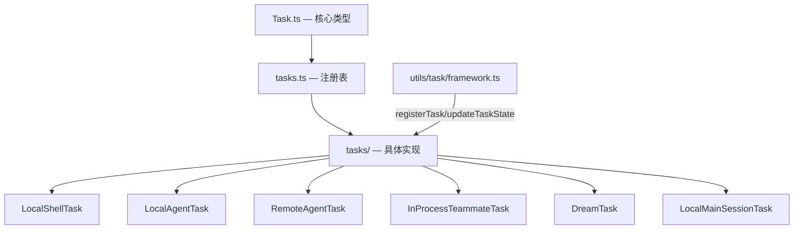

# `tasks/` — 后台任务实现

## 模块概述

`tasks/` 包含所有后台任务类型的**具体实现**。与 [`tasks.ts`（注册表）](../tasks_entry.md) 配合，提供完整的后台任务生命周期管理。

**12 个文件** | **7 种任务类型** | 支持本地 Shell、Agent、远程云端、团队协作、记忆整理

## 架构总览



## 任务类型详解

### 1. `LocalShellTask` — 本地 Shell 命令 (`local_bash`)

**64KB** | 后台执行 shell 命令，最复杂的任务类型

```typescript
type LocalShellTaskState = TaskStateBase & {
  type: 'local_bash'
  command: string
  result?: { code: number; interrupted: boolean }
  shellCommand: ShellCommand | null
  isBackgrounded: boolean
  agentId?: AgentId
  kind?: 'bash' | 'monitor'
}
```

!!! warning "防挂死机制"
    `startStallWatchdog()` 每 5 秒检查输出是否增长，45 秒无增长且末行匹配交互提示模式时发送通知。检测 `(y/n)`、`Press Enter`、`Continue?` 等模式。

**孤儿清理**：`killShellTasksForAgent(agentId)` — Agent 退出时自动杀死其所有 shell 子任务，防止僵尸进程。

### 2. `LocalAgentTask` — 本地子 Agent (`local_agent`)

**81KB** | 本地子 Agent 后台执行

```typescript
type AgentProgress = {
  toolUseCount: number
  tokenCount: number
  lastActivity?: ToolActivity
  recentActivities?: ToolActivity[]  // 最多保留 5 条
}
```

**Token 计算**：`latestInputTokens`（API 累积值取最新）+ `cumulativeOutputTokens`（逐次累加），避免双重计数。

### 3. `RemoteAgentTask` — 远程云端代理 (`remote_agent`)

**123KB** | 最大的任务文件，通过轮询/WebSocket 监控远程 CCR 容器

```typescript
type RemoteTaskType = 'remote-agent' | 'ultraplan' | 'ultrareview'
                    | 'autofix-pr' | 'background-pr'
```

- **完成检查器**：`registerCompletionChecker(type, checker)` — 每次轮询调用，返回非 null 字符串表示完成
- **元数据持久化**：`persistRemoteAgentMetadata()` — fire-and-forget 写入会话侧车
- **Ultraplan 阶段**：`needs_input`（等待用户）/ `plan_ready`（等待批准）

### 4. `InProcessTeammateTask` — 进程内队友 (`in_process_teammate`)

**16KB** | Swarm 团队协作，通过 `AsyncLocalStorage` 隔离

```typescript
type TeammateIdentity = {
  agentId: string      // "researcher@my-team"
  agentName: string    // "researcher"
  teamName: string
  color?: string
  planModeRequired: boolean
  parentSessionId: string
}
```

!!! note "内存优化"
    `TEAMMATE_MESSAGES_UI_CAP = 50` — 限制 AppState 中的消息镜像。分析显示 500+ turn 会话每 agent ~20MB RSS，292 agents 可达 36.8GB。

### 5. `DreamTask` — 后台记忆整理 (`dream`)

后台自动合并散落的会话记忆：

- **阶段**：`starting` → `updating`（首次 Edit/Write 工具调用时切换）
- **Turn 上限**：最多保留 30 条
- **Kill 时回滚**：恢复 consolidation lock 的 mtime，让下一个会话可以重试

### 6. `LocalMainSessionTask` — 主会话后台化

用户按两次 `Ctrl+B` 将当前查询后台化，复用 `LocalAgentTaskState` + `agentType: 'main-session'`。Task ID 前缀 `s`（区别于 Agent 的 `a`）。

## 共享基础设施

### `Task.ts` — 核心类型定义

```typescript
type TaskType = 'local_bash' | 'local_agent' | 'remote_agent'
              | 'in_process_teammate' | 'local_workflow' | 'monitor_mcp' | 'dream'

type TaskStatus = 'pending' | 'running' | 'completed' | 'failed' | 'killed'
```

### `utils/task/framework.ts` — 任务框架

| 函数 | 说明 |
|------|------|
| `registerTask(state, setAppState)` | 注册任务到 AppState |
| `updateTaskState<T>(taskId, setAppState, updater)` | 泛型更新，返回同引用时跳过 |
| `POLL_INTERVAL_MS = 1000` | 标准轮询间隔 |
| `STOPPED_DISPLAY_MS = 3000` | Kill 后显示时长 |
| `PANEL_GRACE_MS = 30000` | 面板保留宽限期 |

### `pillLabel.ts` — 状态栏标签

根据任务类型生成 UI 底部状态栏标签：shells 计数、teams 去重、`◇`（running）/ `◆`（ready）标记。

### `stopTask.ts` — 通用停止逻辑

查找 → 验证 running → 调用 `taskImpl.kill()` → 对 shell 任务抑制 "exit code 137" 通知。

## 任务生命周期

```
工具调用（AgentTool/BashTool/远程启动）
  → 创建任务状态对象（extends TaskStateBase）
  → registerTask(state, setAppState)    写入 AppState.tasks
  → 异步执行（shell/query/poll）
  → updateTaskState() 更新进度
  → 完成时: enqueuePendingNotification() 通知主线程
  → 终止时: isTerminalTaskStatus() → 可被 evict
```

## 总结

`tasks/` 实现了 7 种后台任务类型，从本地 Shell 命令到远程云端代理，支持完整的生命周期管理（注册/进度/通知/终止/清理）。每种任务类型都有独立的状态结构和 kill 逻辑，通过 `Task` 接口统一调度。
